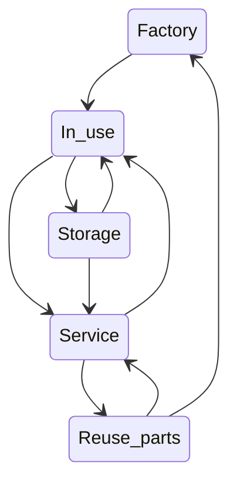

  

Sirk-Tek AS is a Norwegian tech company developing systems and tools to realize
the circular economy.

## Developer information

- [Architecture](https://github.com/sirktek/sirk-tek-documentation/architecture)
- [Development process](https://github.com/sirktek/sirk-tek-documentation/devops)
- [Design guidelines](https://github.com/sirktek/sirk-tek-design)

## The sirk.app application

The sirk.app application is a service to tag and manage assets and inventory.
Tracking and managing the life cycle of assets  makes it possible to reuse, redesign
and if necessary recycle whole or parts of these assets.

- [sirk.app Frontend](https://github.com/sirktek/sirk-app-frontend)
- [sirk.app Backend](https://github.com/sirktek/sirk-app-backend)
